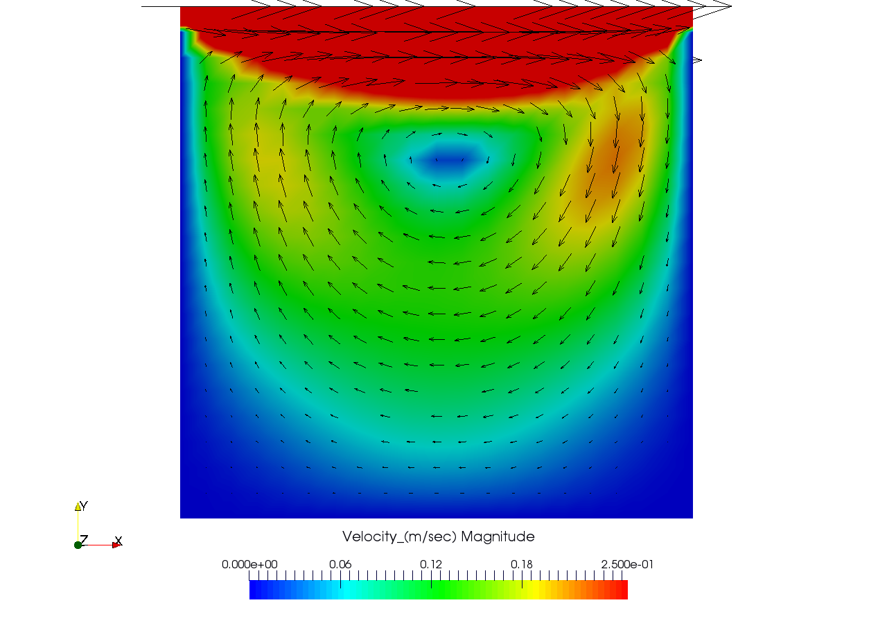

# Navier-Stokes-Equation-solver-for-2D-Cavity-flow
A solver for Navier-Stokes Equation using Finite Difference method for the Cavity flow problem.
The solution is visualized by writing an ASCII .vtk file which can be opened using Paraview.

The Solution is based on Prof. Lorena Barba open CFD course lectures

