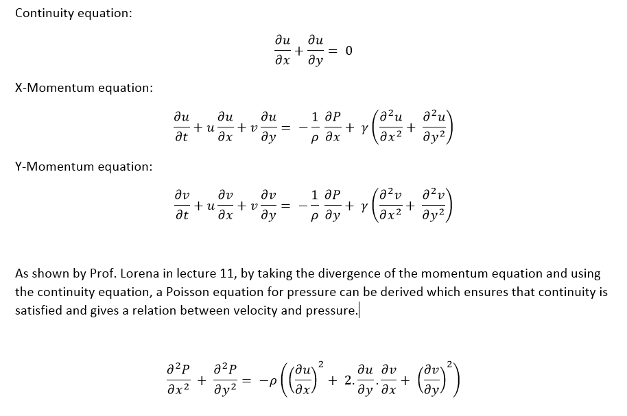
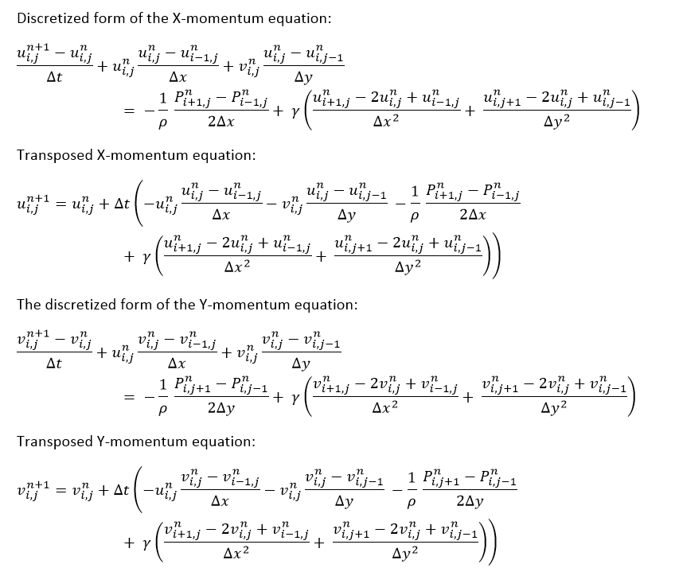
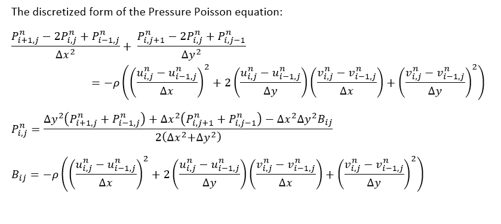
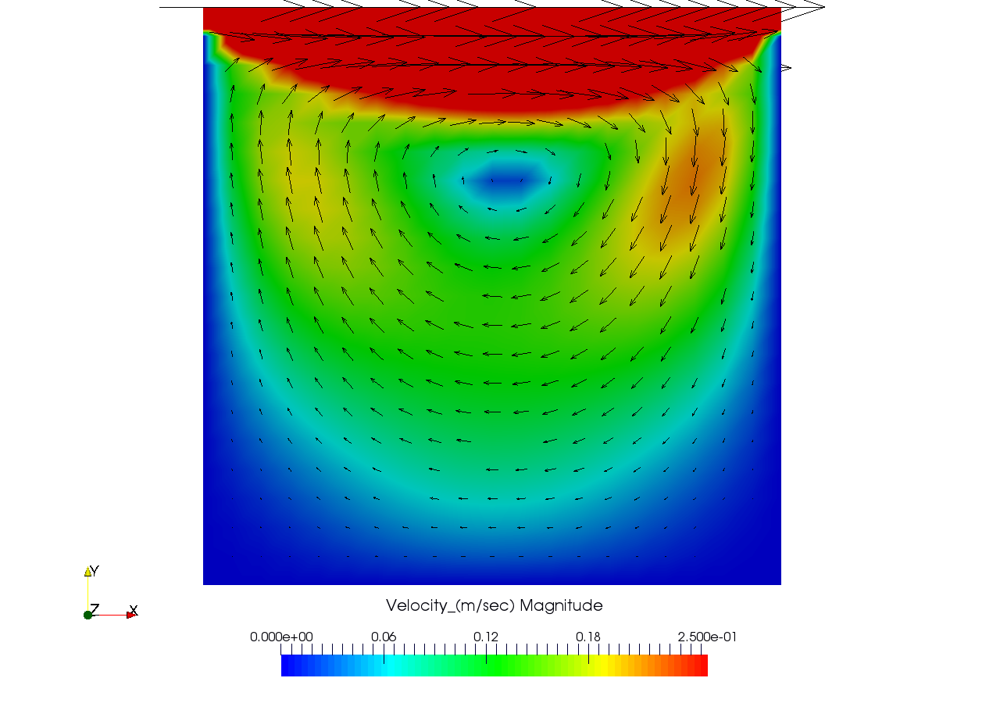

# Navier-Stokes-Equation-solver-for-2D-Cavity-flow
A solver for Navier-Stokes Equation using Finite Difference method for the Cavity flow problem.
The solution is visualized by writing an ASCII .vtk file which can be opened using Paraview.

The Solution is based on Prof. Lorena Barba open CFD course lectures

The Solution is calculated by repeating the following steps for every time step:

1-	The right hand side of the discretized pressure Poisson is calculated and stored in the 2D array named B.

2-	 The transposed form of the pressure Poisson equation is solved iteratively.

3-	 The velocities of the new time step is calculated using the transposed equations of the X-momentum, and Y momentum.

For more details refer to prof. Lorena lectures 11 and 12 at the link below

https://www.youtube.com/playlist?list=PL30F4C5ABCE62CB61

